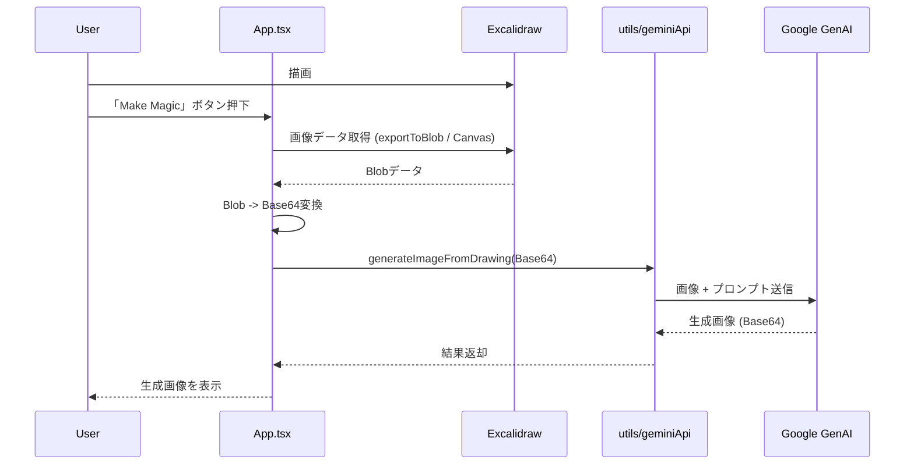

# 開発ガイド - Excali Banana

このドキュメントは、Excali Bananaアプリケーションの仕様、アーキテクチャ、および開発における重要な注意点をまとめたものです。他のLLMやエンジニアが開発を引き継ぐ際の指針として使用してください。

---

## 目次

1. [プロジェクト概要](#1-プロジェクト概要)
2. [アーキテクチャと技術スタック](#2-アーキテクチャと技術スタック)
3. [コンポーネント詳細設計](#3-コンポーネント詳細設計)
4. [重要な実装ロジック](#4-重要な実装ロジック)
5. [トラブルシューティングと開発ルール](#5-トラブルシューティングと開発ルール)
6. [別のLLMモデルへの移行ガイド](#6-別のllmモデルへの移行ガイド)

---

## 1. プロジェクト概要

### 目的
幼児（3〜6歳）向けの創造的な画像生成アプリケーション。Excalidrawで描いた手書きのスケッチを、AI（LLM）を使用して魅力的なイラストに変換します。

### 主要機能
1. **お絵かき機能**: Excalidrawを使用したホワイトボード機能
2. **AI画像生成**: 手書きスケッチを元にしたImage-to-Image変換
3. **テーマ切り替え**: ライトモード/ダークモード
4. **エクスポート**: 描画内容および生成画像のダウンロード

---

## 2. アーキテクチャと技術スタック

### 技術スタック
- **Framework**: React 18.2.0 (厳密なバージョン指定が必要)
- **Build Tool**: Vite (またはそれに準ずる環境)
- **Drawing Engine**: @excalidraw/excalidraw (v0.17.x)
- **AI Model**: Google Gemini 2.5 Flash Image (`gemini-2.5-flash-image`)
- **Styling**: Tailwind CSS

### データフロー概略



---

## 3. コンポーネント詳細設計

各コンポーネントの責務と主要なProps/Stateについて解説します。

### 3.1 App.tsx (Main Container)
アプリケーションのエントリーポイントであり、状態管理の中心です。

*   **責務**:
    *   画面レイアウト（Header, Canvas, Sidebar）の構築
    *   Excalidraw APIインスタンスの保持と管理
    *   テーマ（Light/Dark）の状態管理
    *   画像生成フローのオーケストレーション（描画データの取得からAPI呼び出しまで）

*   **主要State**:
    *   `excalidrawAPI`: Excalidrawを操作するためのAPIオブジェクト。
    *   `theme`: 現在のテーマ設定。
    *   `isMounted`: クライアントサイドレンダリング確認用フラグ。

### 3.2 components/ImageGenerationPanel.tsx
画面右側に配置される、画像生成と結果表示のためのサイドバーです。

*   **責務**:
    *   ユーザーからのプロンプト入力の受け付け
    *   「Make Magic」トリガーの発火
    *   ローディング状態（LoadingSpinner）の表示
    *   生成された画像の表示とダウンロード
    *   エラーメッセージの表示
    *   モバイル表示時のパネル開閉（ドロワー）制御

*   **Props**:
    *   `onGenerateImage`: 画像生成処理を呼び出す非同期関数。`App.tsx`から渡されます。
    *   `theme`: UIのスタイル調整用。

### 3.3 components/Header.tsx
アプリケーション上部のナビゲーションバーです。

*   **責務**:
    *   アプリタイトルの表示
    *   テーマ切り替えボタン
    *   キャンバスクリアボタン
    *   手書き画像のPNGエクスポートボタン

### 3.4 components/LoadingSpinner.tsx
*   **責務**: 画像生成中の待機時間を楽しく見せるためのアニメーションコンポーネント。「バナナ」をモチーフにしたデザインが含まれます。

---

## 4. 重要な実装ロジック

本アプリ特有の技術的課題とその解決策（コード詳細）です。

### 4.1 ExcalidrawのCDNインポート対策 (`App.tsx`)
CDN環境や一部のバンドラーにおいて、ES Modulesの `default` エクスポートの扱いが異なるため、以下のような「防御的インポート」を行っています。

```typescript
// ExcalidrawLibが default プロパティを持っている場合と、直接エクスポートされている場合の両方に対応
const ExcalidrawModule = (ExcalidrawLib as any).default || ExcalidrawLib;
const Excalidraw = ExcalidrawModule.Excalidraw || ExcalidrawModule;
```

### 4.2 画像取得のフォールバック戦略 (`App.tsx`)
Excalidrawのユーティリティ関数 `exportToBlob` が環境によってロードできない場合に備え、二段構えで画像を取得します。

1.  **Plan A: `exportToBlob` を使用**
    *   推奨される方法。API経由で高品質な画像データを生成します。背景色やダークモード設定も反映可能です。
2.  **Plan B: DOM Canvasの直接キャプチャ**
    *   `exportToBlob` が失敗した場合、DOM上の `<canvas>` 要素を直接探し、`.toBlob()` メソッドで画像化します。
    *   これにより、ライブラリの読み込み不全があっても「画像生成ができない」という致命的なバグを防ぎます。

```typescript
// 簡易コード例
let blob = await tryExportToBlob();
if (!blob) {
  // フォールバック: DOMからCanvas要素を探して画像化
  const canvas = document.querySelector('canvas');
  blob = await canvas.toBlob();
}
```

### 4.3 Gemini APIへのマルチモーダル送信 (`utils/geminiApi.ts`)
Gemini 2.5 Flash Imageモデルに対して、Image-to-Image（画像変換）タスクとして認識させるための構成です。

1.  **配列の順序**: `contents` 配列内で、**画像データを先に、テキストプロンプトを後に**配置します。これがGeminiにおける「画像について指示する」際の推奨フォーマットです。
2.  **システム指示の統合**: System Instructionとして分離せず、ユーザープロンプト内に「あなたはプロのイラストレーターです」といった役割定義を含めることで、従順性を高めています。

```typescript
contents: {
  parts: [
    { inlineData: { mimeType: 'image/png', data: base64Data } }, // 画像が先
    { text: "このスケッチを〜に変換して" } // 指示が後
  ]
}
```

---

## 5. トラブルシューティングと開発ルール

### 5.1 Reactバージョンの固定 (重要)
Excalidraw (v0.17+) は **React 18.2.0** に強く依存しています。
*   **症状**: `useMemo` や `useState` で `null` 参照エラーが発生する。
*   **対策**: `index.html` の Import Map でバージョンを固定し、`?deps=react@18.2.0` クエリを使用して依存関係の重複（Multiple React Instances）を防ぎます。

### 5.2 Excalidraw APIの取得
*   **ルール**: `ref` ではなく **`excalidrawAPI` prop** を使用してAPIインスタンスを取得してください。
    *   NG: `<Excalidraw ref={...} />`
    *   OK: `<Excalidraw excalidrawAPI={(api) => setApi(api)} />`

### 5.3 テレメトリのブロックエラー
*   **症状**: コンソールに `net::ERR_BLOCKED_BY_CLIENT` が表示される。
*   **判断**: Google Play開発者サービスのログ送信がブラウザの広告ブロッカー等で遮断されているだけです。アプリの動作には無害なため**無視してください**。

---

## 6. 別のLLMモデルへの移行ガイド

AIモデルをGeminiから他（OpenAI DALL-E 3, Stability AIなど）へ変更する場合は、`utils/geminiApi.ts` を修正するだけで対応できるよう設計されています。

### インターフェース定義 (`types.ts`)
```typescript
interface GenerateImageOptions {
  imageData: string;       // Base64 (data:image/png;base64,...)
  customPrompt?: string;   // ユーザーのカスタム指示
}

interface GenerateImageResult {
  success: boolean;
  imageBase64?: string;    // 生成された画像
  error?: string;
}
```

### 移行時のチェックポイント
1.  **Stability AI**: `init_image` パラメータを使用する `Image-to-Image` APIを選択してください。
2.  **OpenAI (DALL-E 3)**: DALL-E 3は直接画像編集ができません。GPT-4 Visionで画像を詳細にテキスト化し、そのプロンプトでDALL-E 3により新規生成するパイプラインを構築する必要があります。

---
**最終更新日**: 2024/05/23
**作成者**: Excali Banana Team
